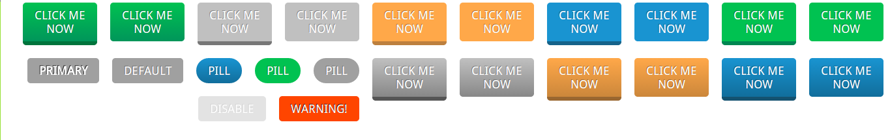

## fragrant-button ##

### Screenshot ###


### About fragrant-button ###
fragrant-button is a set of CSS3 buttons, they're flat designed but we offer three D buttons and gradient buttons, 
so they're fragrant, tasty huh!
We hope to provide a high flexibility, high configure buttons and button components.

### Try ###

Taste the default button:
```html
<button class="btn">
  BUTTON
</button>
```
Plain huh, just add some color, we offer green, blue, orange and silver(default):
```html
  <button class="btn green">
    GREEN
  </button>
```
generates green button.
```html
<button class="btn orange">
  ORANGE
</button>
```
generates orange button.
The default is flat, make it 3D:
```html
<button class="btn blue threed">
  3D BLUE
</button>
```
generates a 3D button.
Flat is nonsense, make it gradient and more real:
```html
<button class="btn green gradient">
  GRANDIENT GREEN
</button>
```
generates a gradient green button.
Different kinds of basic buttons, **primary, warning and disable, and pill shaped**, there may be more in the future.

### TODO ###

* button group
* integrate to certain frontend framework
* other interesting elements
* rewrite with SCSS

### License ###
MIT

### Future ###
Any color schemes are my personal idea, feel free to modify them with your brilliant artistic skills.
